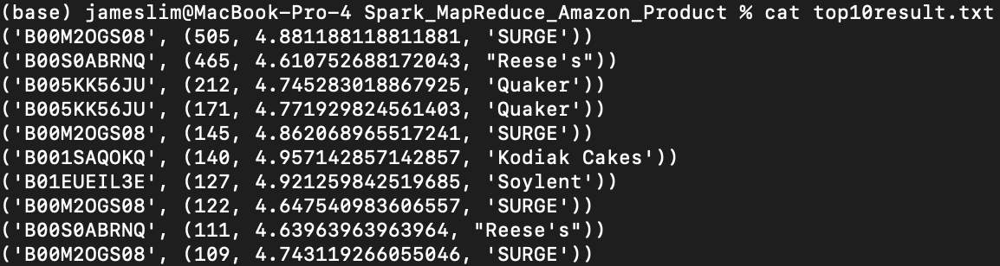

# Spark_MapReduce_Amazon_Product

## Objective

Develop a Spark program to analyse the Amazon Grocery and Gourmet Food dataset and identify the top 10 products based on the daily number of reviews.
Report the average rating and brand name of these products.

---

## Dataset

The link to the Amazon product dataset can be downloaded from this [LINK](https://cseweb.ucsd.edu/~jmcauley/datasets/amazon_v2). 
Download from "Per-category data" section the following:
- Grocery and Gourmet Food Reviews File: **Grocery_and_Gourmet_Food.json**
- Grocery and Gourmet Food Metadata: **meta_Grocery_and_Gourmet_Food.json**

---

## High-Level Algorithm

1. Review Analysis: Create a pair RDD from the review file. The key is product ID/asin, and the value is a tuple comprising of the number of reviews and average ratings. `reduceByKey` and `map` functions are used to compute the daily number of reviews and average ratings.
1. Metadata integration: Create an RDD from the metadata file where the key is the produce ID/asin, and the value is the brand name of the product.
1. Joining datasets: Merge the pair RDD from Step 1 with the brand name RDD from Step 2.
1. Identifying top products: Find the top 10 products with the highest number of daily reviews.
1. Output generation: Output the data for the top 10 products, including review count, average rating and brand name. Each line in the output file corresponds to a product that follows the format of `<product ID> <review count> <average rating> <brand name>`.

---

## Low-Level Algorithm

1. Metadata Integration: Create an RDD from the metadata file where the key = `asin`, and value = `brand`.
    - Delete existing `meta_rdd` output directory to avoid Spark error on existing file with same name.
    - Read the meta data and convert into RDD.
    - Map meta data with new RDD containing just `asin` and `brand`.
    - Filter the RDD with any record having empty `brand`.
    - Save in a folder
    - Concatenating output files from all slave nodes.
1. Review Analysis: Create an RDD from review file where key = `asin`, and value = (`average_rating`, `daily_review_count`).
    - Delete existing review output directory to avoid Spark error on existing file with same name.
    - Read the review data and convert into RDD.
    - Map review data with new RDD containing just `asin`, `reviewTime`, and `overall`.
    - Filter the RDD with any record having empty `asin`, empty `reviewTime`, or unexpected `overall`.
    - Transformation: key = (`asin`, `reviewTime`), value = `overall` ===> key = (`asin`, `reviewTime`), value = (`overall`, 1).
    - `reduceByKey`: For matching key = (`asin`, `reviewTime`), sum `overall` rating and `review_count` = 1 per record respectively.
    - Transformation: key = (`asin`, `reviewTime`), value = (`overall`, 1) ===> key = (`asin`, `reviewTime`), value = (`average_rating`, `daily_review_count`).
    - Sort in descending order based on `daily_review_count`.
    - Transformation: key = (`asin`, `reviewTime`), value = (`average_rating`, `daily_review_count`) ===> key = `asin`, value = (`daily_review_count`, `average_rating`, `reviewTime`).
    - Save in a folder.
    - Concatenating output files from all slave nodes.
1. Review Analysis: Merge `meta_rdd` and `review_rdd` based on key = `asin`.
    - Delete existing review output directory to avoid Spark error on existing file with same name.
    - Merge `review_rdd` and `meta_rdd` based on key = `asin`.
    - Transformation: key = `asin`, value = ((`daily_review_count`, `average_rating`, `reviewTime`), `brand`) ===> key = `asin`, value = (`daily_review_count`, `average_rating`, `brand`).
    - Sort in descending order based on `daily_review_count`.
    - Save in a folder
    - Concatenating output files from all slave nodes.
    - Save top 10 brand with highest daily review count.

---

## Technologies

List of technologies used for the environment setup:
1. Java version: 1.8.0_391
1. Maven version: 3.5.2
1. Scala version: 2.12.4
1. Apache Spark version: 3.0.0
1. Hadoop version: 2.7.0
1. PySpark version: 3.5.0
1. OS: MacOS x, v14.2.1, arch aarch64

---

## Command Execution

```bash
python script.py
```

---

## Result

List of output files:
1. top10result.txt: Contains final answer to the problem statement.
1. review_rdd_outfile.txt: Contains final form of review RDD.
1. meta_rdd_outfile.txt: Contains final form of meta RDD.


